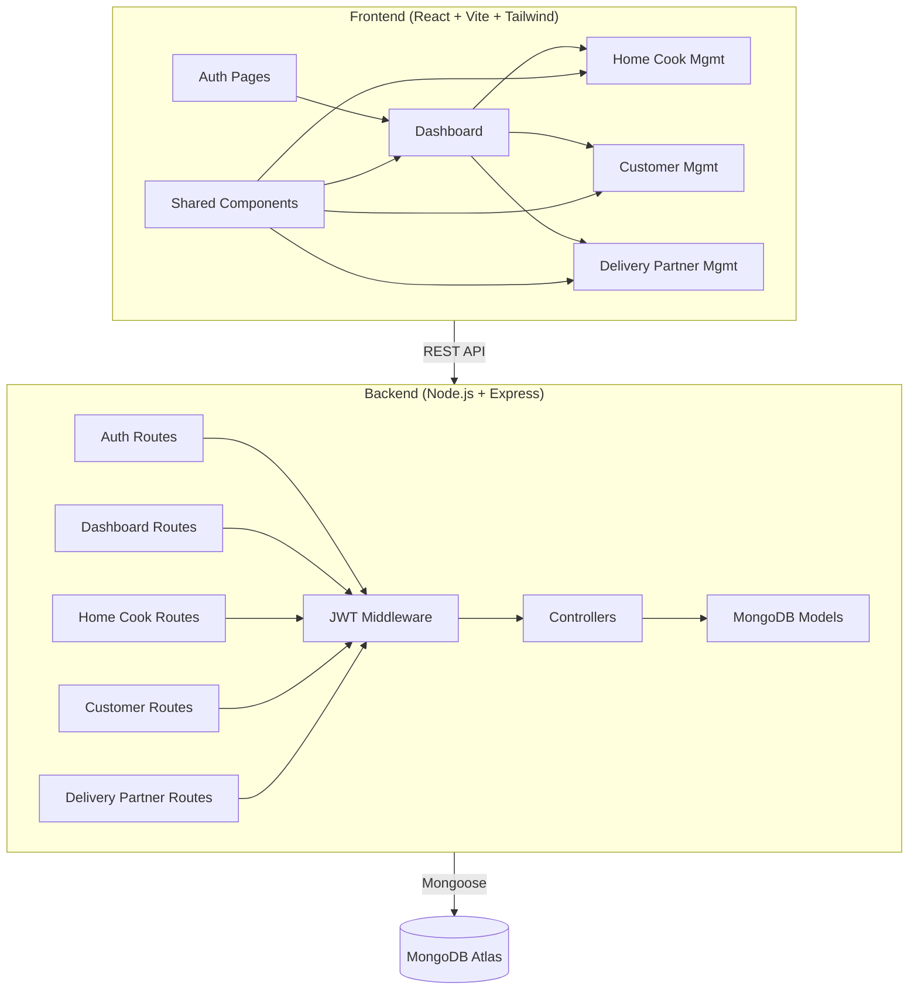

# Cloud Kitchen Admin Panel — Implementation Plan (Member 1)

## 1. Project Overview

Build a **full-stack Admin Panel** for a Cloud Kitchen platform with:
- **Frontend**: React + Tailwind CSS (Vite)
- **Backend**: Node.js + Express + MongoDB
- **Auth**: JWT-based authentication
- **Goal**: Modular, team-friendly, and **React Native convertible**

---

## 2. Architecture Diagram



---

## 3. Folder Structure

```
CLOUD KITCHEN/
├── client/                          # React Frontend
│   ├── public/
│   ├── src/
│   │   ├── api/                     # Axios instance + API service files
│   │   │   ├── axiosInstance.js
│   │   │   ├── authApi.js
│   │   │   ├── dashboardApi.js
│   │   │   ├── homeCookApi.js
│   │   │   ├── customerApi.js
│   │   │   └── deliveryPartnerApi.js
│   │   ├── components/              # Reusable UI components
│   │   │   ├── common/              # Buttons, Inputs, Modals, Tables
│   │   │   ├── layout/              # Sidebar, Navbar, Layout wrapper
│   │   │   └── charts/              # Chart components (Recharts)
│   │   ├── pages/                   # Page-level components
│   │   │   ├── auth/
│   │   │   │   └── LoginPage.jsx
│   │   │   ├── dashboard/
│   │   │   │   └── DashboardPage.jsx
│   │   │   ├── homeCooks/
│   │   │   │   ├── HomeCookListPage.jsx
│   │   │   │   └── HomeCookDetailPage.jsx
│   │   │   ├── customers/
│   │   │   │   ├── CustomerListPage.jsx
│   │   │   │   └── CustomerDetailPage.jsx
│   │   │   └── deliveryPartners/
│   │   │       ├── DeliveryPartnerListPage.jsx
│   │   │       └── DeliveryPartnerDetailPage.jsx
│   │   ├── context/                 # React Context for auth state
│   │   │   └── AuthContext.jsx
│   │   ├── hooks/                   # Custom hooks (useAuth, useFetch)
│   │   ├── utils/                   # Helpers, constants, formatters
│   │   ├── App.jsx
│   │   ├── main.jsx
│   │   └── index.css
│   ├── tailwind.config.js
│   ├── vite.config.js
│   └── package.json
│
├── server/                          # Express Backend
│   ├── config/
│   │   └── db.js                    # MongoDB connection
│   ├── controllers/
│   │   ├── authController.js
│   │   ├── dashboardController.js
│   │   ├── homeCookController.js
│   │   ├── customerController.js
│   │   └── deliveryPartnerController.js
│   ├── middleware/
│   │   ├── authMiddleware.js        # JWT verification
│   │   └── errorHandler.js
│   ├── models/
│   │   ├── Admin.js
│   │   ├── HomeCook.js
│   │   ├── Customer.js
│   │   ├── DeliveryPartner.js
│   │   └── Order.js
│   ├── routes/
│   │   ├── authRoutes.js
│   │   ├── dashboardRoutes.js
│   │   ├── homeCookRoutes.js
│   │   ├── customerRoutes.js
│   │   └── deliveryPartnerRoutes.js
│   ├── seeders/
│   │   └── seed.js                  # Database seeder
│   ├── server.js
│   └── package.json
│
├── .env
└── README.md
```

---

## 4. Database Schemas

### Admin
| Field       | Type   | Notes            |
|-------------|--------|------------------|
| name        | String | Required         |
| email       | String | Unique, Required |
| password    | String | Hashed (bcrypt)  |
| role        | String | "superadmin" / "admin" |
| createdAt   | Date   | Auto             |

### HomeCook
| Field          | Type     | Notes                              |
|----------------|----------|------------------------------------|
| name           | String   | Required                           |
| email          | String   | Unique                             |
| phone          | String   | Required                           |
| address        | String   |                                    |
| speciality     | [String] | Cuisine types                      |
| status         | String   | pending / approved / rejected / suspended |
| rating         | Number   | 0-5                                |
| totalOrders    | Number   | Default 0                          |
| documents      | Object   | { idProof, fssaiLicense }          |
| profileImage   | String   | URL                                |
| createdAt      | Date     |                                    |

### Customer
| Field        | Type     | Notes                    |
|--------------|----------|--------------------------|
| name         | String   | Required                 |
| email        | String   | Unique                   |
| phone        | String   |                          |
| address      | [Object] | Multiple saved addresses |
| status       | String   | active / blocked         |
| totalOrders  | Number   |                          |
| totalSpent   | Number   |                          |
| joinedAt     | Date     |                          |

### DeliveryPartner
| Field          | Type     | Notes                              |
|----------------|----------|------------------------------------|
| name           | String   | Required                           |
| email          | String   | Unique                             |
| phone          | String   | Required                           |
| vehicleType    | String   | bike / scooter / car               |
| vehicleNumber  | String   |                                    |
| status         | String   | pending / approved / rejected / suspended |
| isAvailable    | Boolean  | For order assignment               |
| documents      | Object   | { license, idProof, vehicleRC }    |
| currentOrderId | ObjectId | ref: Order                         |
| totalDeliveries| Number   |                                    |
| rating         | Number   |                                    |
| createdAt      | Date     |                                    |

### Order
| Field            | Type     | Notes                              |
|------------------|----------|------------------------------------|
| orderNumber      | String   | Unique, auto-generated             |
| customerId       | ObjectId | ref: Customer                      |
| homeCookId       | ObjectId | ref: HomeCook                      |
| deliveryPartnerId| ObjectId | ref: DeliveryPartner               |
| items            | [Object] | { name, qty, price }               |
| totalAmount      | Number   |                                    |
| status           | String   | placed / preparing / ready / picked / delivered / cancelled |
| paymentStatus    | String   | pending / paid / refunded          |
| deliveryAddress  | Object   |                                    |
| createdAt        | Date     |                                    |

---

## 5. API Endpoints

### Authentication
| Method | Endpoint            | Description      |
|--------|---------------------|------------------|
| POST   | /api/auth/login     | Admin login      |
| GET    | /api/auth/profile   | Get admin profile|
| POST   | /api/auth/logout    | Logout           |

### Dashboard
| Method | Endpoint              | Description           |
|--------|-----------------------|-----------------------|
| GET    | /api/dashboard/stats  | Key statistics        |
| GET    | /api/dashboard/charts | Chart data (revenue, orders) |

### Home Cooks
| Method | Endpoint                      | Description            |
|--------|-------------------------------|------------------------|
| GET    | /api/home-cooks               | List all (paginated)   |
| GET    | /api/home-cooks/:id           | Get single             |
| POST   | /api/home-cooks               | Create new             |
| PUT    | /api/home-cooks/:id           | Update                 |
| PATCH  | /api/home-cooks/:id/status    | Approve/Reject/Suspend |
| DELETE | /api/home-cooks/:id           | Delete                 |

### Customers
| Method | Endpoint                      | Description            |
|--------|-------------------------------|------------------------|
| GET    | /api/customers                | List all (paginated)   |
| GET    | /api/customers/:id            | Get single + orders    |
| PUT    | /api/customers/:id            | Update                 |
| PATCH  | /api/customers/:id/status     | Block/Unblock          |
| DELETE | /api/customers/:id            | Delete                 |

### Delivery Partners
| Method | Endpoint                              | Description            |
|--------|---------------------------------------|------------------------|
| GET    | /api/delivery-partners                | List all (paginated)   |
| GET    | /api/delivery-partners/:id            | Get single             |
| POST   | /api/delivery-partners                | Create new             |
| PUT    | /api/delivery-partners/:id            | Update                 |
| PATCH  | /api/delivery-partners/:id/status     | Approve/Reject/Suspend |
| PATCH  | /api/delivery-partners/:id/verify     | Verify documents       |
| PATCH  | /api/delivery-partners/:id/assign     | Assign order           |
| DELETE | /api/delivery-partners/:id            | Delete                 |

---

## 6. React Native Conversion Strategy

> [!IMPORTANT]
> The architecture is designed for easy React Native migration.

| Aspect | Web (React) | Mobile (React Native) |
|--------|-------------|----------------------|
| **Business Logic** | `api/`, `context/`, `hooks/`, `utils/` — **reuse 100%** | Same files, no changes |
| **Navigation** | React Router DOM | React Navigation |
| **UI Components** | HTML + Tailwind | React Native components (NativeWind for Tailwind) |
| **Charts** | Recharts | react-native-chart-kit |
| **Storage** | localStorage | AsyncStorage |
| **HTTP Client** | Axios | Axios (same) |

**Key Decisions for Portability:**
1. All business logic lives in `api/`, `hooks/`, `context/` — completely UI-agnostic
2. No direct DOM manipulation
3. State management via React Context (works in both)
4. API layer is fully decoupled from UI

---

## 7. Implementation Phases

### Phase 1: Project Setup & Auth ⏱️ ~30 min
- [x] Initialize Vite + React + Tailwind (client)
- [x] Initialize Express + MongoDB (server)
- [x] Admin model + JWT auth
- [x] Login page + protected routes

### Phase 2: Dashboard ⏱️ ~20 min
- [x] Dashboard API (aggregate stats)
- [x] Dashboard UI with stat cards + charts
- [x] Responsive layout with sidebar

### Phase 3: Home Cook Management ⏱️ ~25 min
- [x] CRUD APIs
- [x] List view with filters & search
- [x] Detail/edit modal
- [x] Status management (approve/reject/suspend)

### Phase 4: Customer Management ⏱️ ~20 min
- [x] CRUD APIs
- [x] List view + order history
- [x] Block/unblock functionality

### Phase 5: Delivery Partner Management ⏱️ ~25 min
- [x] CRUD APIs
- [x] Document verification workflow
- [x] Order assignment
- [x] Availability tracking

### Phase 6: Seeder & Polish ⏱️ ~10 min
- [x] Database seeder with realistic data
- [x] Error handling & loading states
- [x] Final responsive polish

---

## 8. Key Dependencies

### Client
| Package | Purpose |
|---------|---------|
| react, react-dom | UI framework |
| react-router-dom | Client-side routing |
| axios | HTTP client |
| recharts | Charts/graphs |
| react-icons | Icon library |
| react-hot-toast | Toast notifications |
| tailwindcss v3 | Utility CSS |

### Server
| Package | Purpose |
|---------|---------|
| express | Web framework |
| mongoose | MongoDB ODM |
| bcryptjs | Password hashing |
| jsonwebtoken | JWT tokens |
| cors | Cross-origin requests |
| dotenv | Environment variables |
| express-validator | Input validation |

---

> [!NOTE]
> This plan is designed so that **other team members** can add their modules (e.g., Menu Management, Order Processing, Payments) by simply adding new route files, controllers, models, and page components — no changes needed to the core structure.
